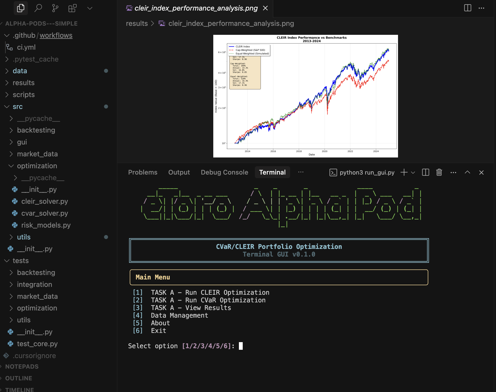
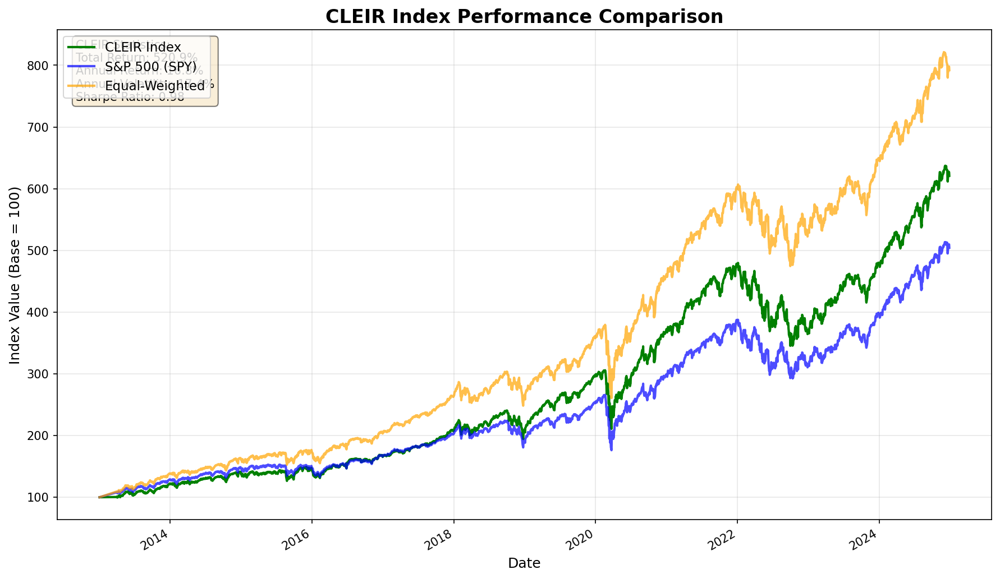
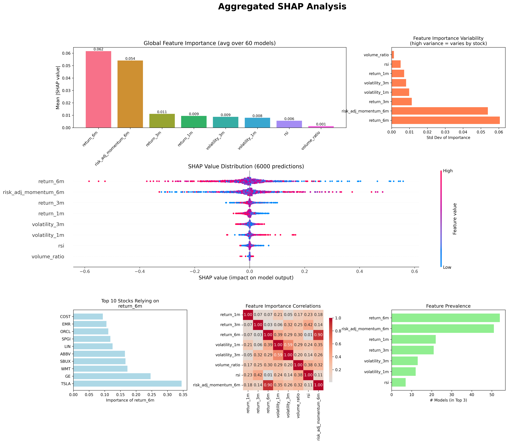

# Alpha-Pods---Simple

This project provides a comprehensive framework for constructing and backtesting equity portfolios using both traditional and machine-learning-enhanced optimization techniques, to complete Tasks A and B of the eToro Alphapod challenge.



## Quick Quick Start:
```
python3 run_gui.py
```

## Quick Start

1.  **Set up the environment:**
    ```bash
    conda env create -f environment.yml
    conda activate cvar-index
    ```

2.  **Run GUI:**
    ```bash
    python run_gui.py
    ```


## Overview

The framework implements two primary portfolio optimization strategies:

*   **Standard CVaR Optimization**: Minimizes the 95% Conditional Value at Risk (CVaR) of portfolio returns to manage tail risk.
*   **CLEIR (CVaR-LASSO Enhanced Index Replication)**: Minimizes the CVaR of tracking error against a benchmark while enforcing sparsity with an L1-norm constraint for concentrated, low-turnover portfolios.

An ML-enhanced version of CLEIR is also included, which uses Ridge regression to predict stock-level alpha and inform portfolio construction.

Find the raw scripts in the src > optimization folder.

*Task A* = cleir_solver.py
*Task B* = ml_cleir_optimizer.py

## Results

**Task A**



**Task B**



The backtesting scripts generate the following files in the `results/` directory:

*   `daily_index_values.csv` and `cleir_index_gui.csv`: Task A Daily index values for the CLEIR strategy.
*   `ml_portfolio_weights.csv`: Portfolio weights at each rebalancing date.
*   `performance_comparison.png`: A chart visualizing the performance of different strategies.
*   `ml_shap_analysis.png`: SHAP analysis plots for interpreting the ML model's predictions.
*   `ml_predictions_analysis.png`: Diagnostic plots for the ML model's predictions.
  
## Methodology

The CLEIR model is based on the following optimization problem:

min_w CVaR_α(Rₚ − R_b)

subject to:  
∑ |wᵢ| ≤ s, ∑ wᵢ = 1, wᵢ ≥ 0

where Rₚ is the portfolio return, R_b is the benchmark return, w are the portfolio weights, α is the CVaR confidence level, and s is the sparsity bound.

## References

1.  Rockafellar, R.T. and Uryasev, S. (2002). Conditional value-at-risk for general loss distributions. *Journal of Banking & Finance*, 26(7), 1443-1471.
2.  Krokhmal, P., Palmquist, J., & Uryasev, S. (2002). Portfolio optimization with conditional value-at-risk objective and constraints. *Journal of Risk*, 4, 43-68.
